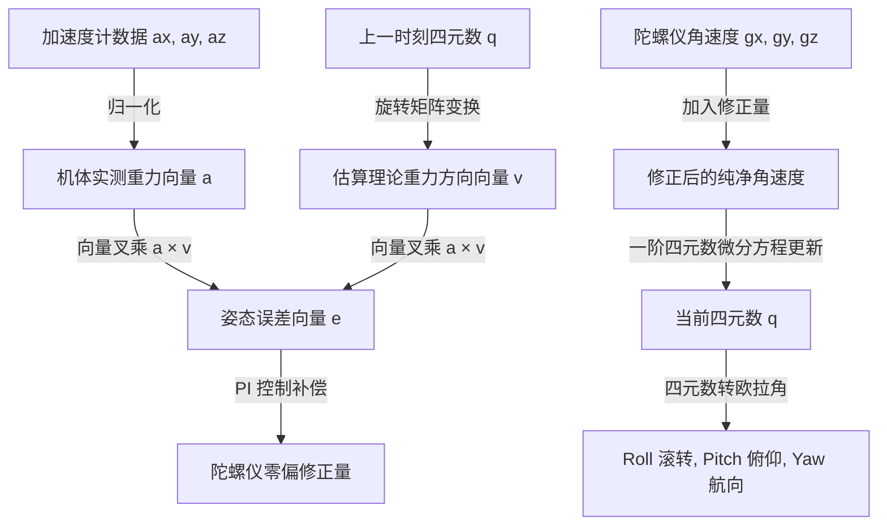

# 穿越机核心控制理论与飞控算法详解

本文档为嵌入式飞控开发者详细推导并解释飞控固件的核心算法原理，涵盖：**数字滤波**、**Mahony 姿态解算**、**串级 PID 控制器**、**四轴混控矩阵**与 **DShot 数字电调协议**。

---

## 一、 坐标系与传感器数据预处理

### 1. 机体机体坐标系（Body Frame）
飞控统一采用右手笛卡尔坐标系：
* **$X$ 轴（Roll 滚转轴）**：机头正前方为正，向右倾斜为正角度。
* **$Y$ 轴（Pitch 俯仰轴）**：机头右侧方向为正，机头向上抬头为正角度。
* **$Z$ 轴（Yaw 偏航轴）**：机顶正上方为正，俯视顺时针旋转为正角速度。

### 2. 数字低通滤波（Low-Pass Filter, LPF）
无刷电机的机械换向与桨叶震动会在 IMU 上产生 **200Hz ~ 800Hz** 的极强高频噪声。如果这些噪声直接进入微分器（PID 的 D 环），微分项放大高频噪声会导致电机严重发烫甚至飞控失控。

固件采用一阶数字低通滤波器：
$$y[k] = y[k-1] + \alpha \cdot (x[k] - y[k-1])$$
其中滤波系数 $\alpha = \frac{2\pi f_c \Delta t}{1 + 2\pi f_c \Delta t}$，$f_c$ 为截止频率（通常陀螺仪设为 $90\text{Hz} \sim 150\text{Hz}$），$\Delta t$ 为采样周期（例如 $1\text{ms}$）。

---

## 二、 Mahony 姿态解算算法（AHRS）

姿态解算的核心任务是：融合**陀螺仪（响应极快但随时间漂移）**与**加速度计（静态重力方向准确但动态噪声大）**，计算出当前机身相对于地球参考系的四元数 $q = [q_0, q_1, q_2, q_3]^T$。



### 核心公式步骤：
1. **重力向量估算**：由当前四元数推算出机体坐标系下的理论重力向量：
   $$\vec{v} = \begin{bmatrix} 2(q_1 q_3 - q_0 q_2) \\ 2(q_0 q_1 + q_2 q_3) \\ q_0^2 - q_1^2 - q_2^2 + q_3^2 \end{bmatrix}$$
2. **计算误差向量（向量叉乘）**：
   $$\vec{e} = \vec{a}_{norm} \times \vec{v}$$
3. **PI 控制器补偿零偏**：
   $$\vec{\omega}_{corr} = \vec{\omega}_{gyro} + K_p \cdot \vec{e} + K_i \int \vec{e} \, dt$$
4. **四元数一阶龙格-库塔数值积分更新**：
   $$\dot{q} = \frac{1}{2} q \otimes \vec{\omega}_{corr}$$
   $$q[k+1] = q[k] + \dot{q} \cdot \Delta t$$
5. **四元数归一化与欧拉角转换**：
   $$\text{Roll} = \arctan2\left(2(q_0 q_1 + q_2 q_3), 1 - 2(q_1^2 + q_2^2)\right)$$
   $$\text{Pitch} = \arcsin\left(2(q_0 q_2 - q_3 q_1)\right)$$
   $$\text{Yaw} = \arctan2\left(2(q_0 q_3 + q_1 q_2), 1 - 2(q_2^2 + q_3^2)\right)$$

---

## 三、 串级 PID 控制器（Cascade PID）

穿越机自稳控制采用**双环串级 PID 架构**：

```
[遥控期望角度] ---> (+) --- [外环: 角度环 P] ---> [期望角速度]
                    ▲ -                               ▲
                    |                                 |
              [实际姿态角度]                    (+) --+
                                                 ▲ -
                                                 |
                                           [内环: 角速度环 PID] ---> [混控力矩输出]
                                                 ▲
                                                 |
                                           [实际陀螺仪速率]
```

### 1. 外环：角度环（Angle Loop，运行于 250Hz ~ 500Hz）
* **目标**：计算当前姿态角度与飞行员打杆期望角度之间的偏差。
* **算法**：通常仅使用**纯比例（P 控制）**：
  $$\text{Rate}_{target} = K_{p\_angle} \times (\text{Angle}_{target} - \text{Angle}_{actual})$$
* 输出值即为内环的“目标角速度”。

### 2. 内环：角速度环（Rate Loop，运行于 1kHz ~ 4kHz）
* **目标**：以极高频率消除外界阵风带来的旋转扰动，保持飞行极其稳健。
* **算法**：完整的 **PID 控制**：
  $$u(t) = K_p \cdot e(t) + K_i \int_0^t e(\tau) d\tau + K_d \cdot \frac{d(\text{Gyro})}{dt}$$
* **工程防发散细节**：
  * **积分抗饱和（Anti-Windup）**：对积分累积值做硬限幅，油门打满或地面未起飞时冻结积分。
  * **微分先行（Derivative on Measurement）**：直接对陀螺仪反馈值求微分，避免打杆瞬间设定值突变带来的“微分冲击”。

---

## 四、 X 型四轴混控器（Mixer）

混控器将飞行员的**油门（Throttle）**输入与三轴 PID 输出的力矩纠正量（$U_{roll}, U_{pitch}, U_{yaw}$）合成为分配给 4 个电机的实际油门：

```
      机头前方 (Forward)
      M4 (CW)      M2 (CCW)
         \        /
          \      /
           [飞控]
          /      \
         /        \
      M3 (CCW)     M1 (CW)
```

### 混控矩阵公式：
$$M_1 = \text{Throttle} - U_{roll} + U_{pitch} + U_{yaw}$$
$$M_2 = \text{Throttle} - U_{roll} - U_{pitch} - U_{yaw}$$
$$M_3 = \text{Throttle} + U_{roll} + U_{pitch} - U_{yaw}$$
$$M_4 = \text{Throttle} + U_{roll} - U_{pitch} + U_{yaw}$$

> 固件会对每个电机的最终输出限制在 `[MIN_THROTTLE, MAX_THROTTLE]`（例如 DShot 的 48~2047）。

---

## 五、 电调数字协议：DShot 协议原理

传统 PWM 信号（1000μs ~ 2000μs）需要做电调行程校准，且容易受到地电平偏移干扰。本项目采用现代穿越机标准的 **DShot300/600 数字协议**。

### 1. 协议帧格式（16-Bit 数字数据流）
每个电机指令由连续的 16 位二进制脉冲组成：
```
+---------------------------+-----------+---------------+
|    Throttle (11 Bits)     | Telemetry |  CRC (4 Bits) |
|         0 ~ 2047          |  (1 Bit)  | 校验码 (4位)  |
+---------------------------+-----------+---------------+
```
* **Bit 0 ~ 10**：油门量。`0` 表示停转，`1~47` 为专用控制指令（如蜂鸣反转），`48~2047` 为实际动力油门（2000 级高分辨率）。
* **Bit 11**：请求电调回传遥测数据（转速 RPM 等）。
* **Bit 12 ~ 15**：CRC4 循环冗余校验码，公式为 `(Throttle ^ (Throttle >> 4) ^ (Throttle >> 8)) & 0x0F`。

### 2. 硬件实现机制
STM32 利用 **通用定时器（TIM3）配合 DMA 突发传输（DMA Burst）**，将 16 位电平的占空比数组直接由 DMA 刷入定时器的比较寄存器（CCR），产生毫秒级无抖动的绝对精确数字波形，CPU 占用率接近 0%！
